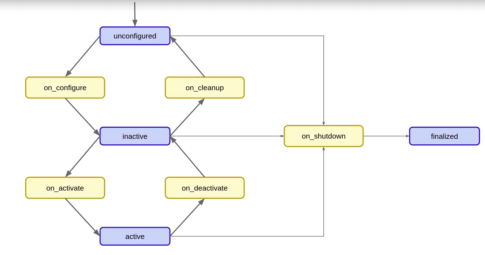

# Lifecycle Nodes

Code: [`src/lifecycle_py`](../src/lifecycle_py)



## In short

1. A node has states it can switch between (unconfigured, inactive, active, finalized). This is its lifecycle, a **state machine**.
2. The lifecycle gives simple interfaces for switching between these states.

## Why lifecycle nodes?

Lifecycle nodes give you a managed way to control a node's state. They're especially useful when nodes need to be initialised, started, paused or shut down in a predictable, controlled way.

1. **State management:** a well-defined state machine lets you manage the node's behaviour at each stage of its lifecycle.
2. **Resource management:** by moving between states, you control when resources (hardware, memory) are allocated and released.
3. **Predictable behaviour:** each state transition has a callback, so initialisation, activation and shutdown behave consistently.
4. **Easier debugging:** explicit state transitions make the node's behaviour easier to follow, especially in complex systems.
5. **System integration:** ideal when nodes must be coordinated, e.g. sensors and actuators that must be activated in a specific order.
6. **Flexibility:** nodes can be paused and resumed without restarting the whole system, e.g. for maintenance or reconfiguration.

## When to use them

1. Hardware communication
2. Software or hardware that must be initialised in a specific order
3. Allocating resources and memory first
4. Synchronising initialisation across several nodes

## Files

1. `number_publisher.py` (in `my_py_pkg`): the normal node
2. `number_publisher_lifecycle.py`: the same node as a lifecycle node
3. `lifecycle_node_manager.py`: a node that drives another node through its states

## Code

1. Inherit from `LifecycleNode`.
2. `create_lifecycle_publisher()`: doesn't publish until the node is in the **active** state.
3. **All transition callbacks are optional.** Override only the ones you need.

## Command line

```bash
ros2 lifecycle                               # sub-commands: get, list, nodes, set
ros2 lifecycle nodes                         # list all lifecycle nodes
ros2 lifecycle get /lifecycle_node           # current state of the node
ros2 lifecycle list /lifecycle_node          # transitions available from the current state
ros2 lifecycle set /lifecycle_node configure # trigger the "configure" transition
ros2 service list                            # shows the services each lifecycle node offers
```

## Lifecycle manager

A node that manages the lifecycle state of one or more nodes through their services:
1. `change_state`
2. `get_state`
